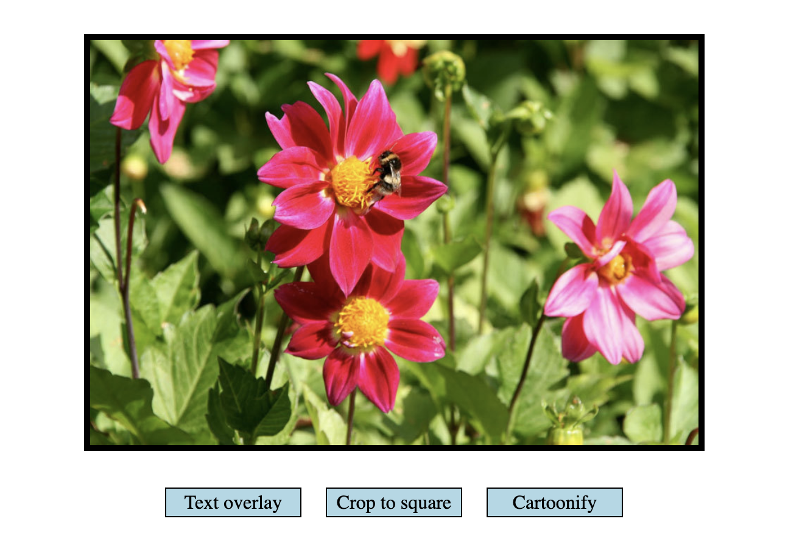
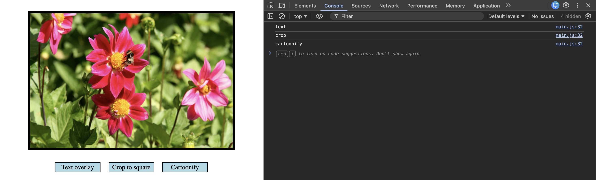
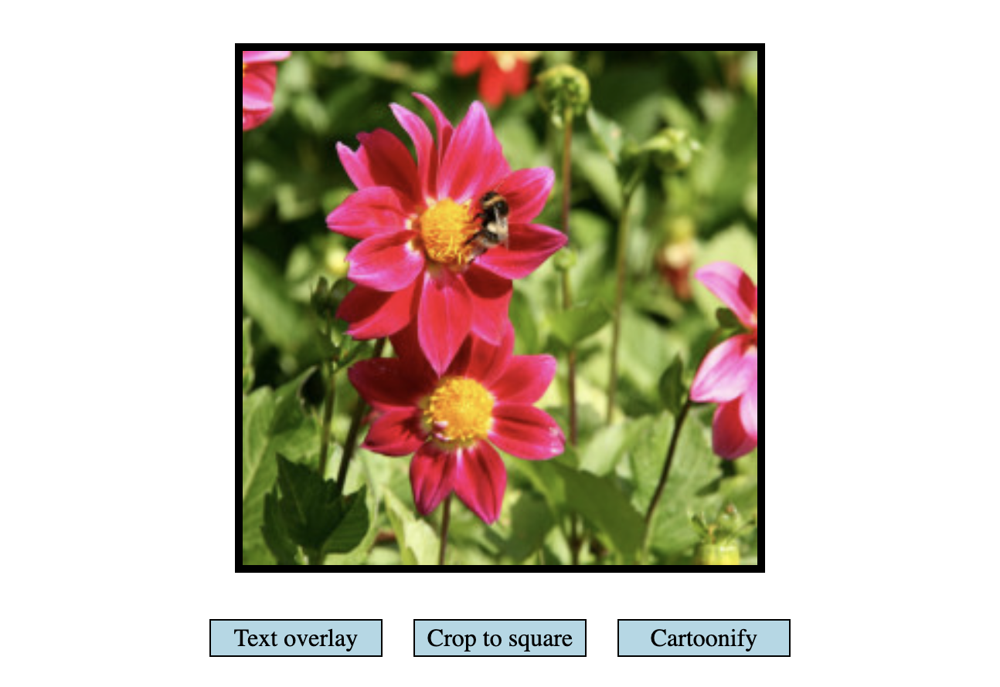
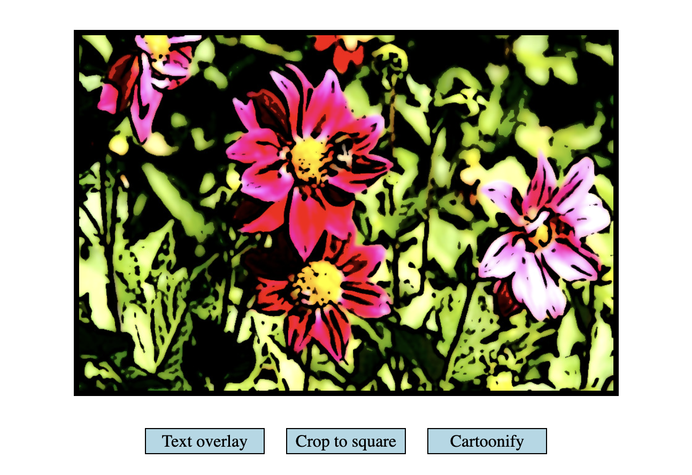
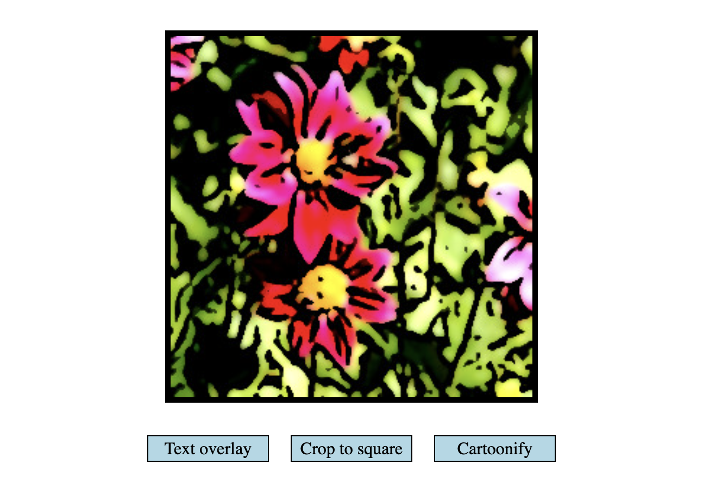
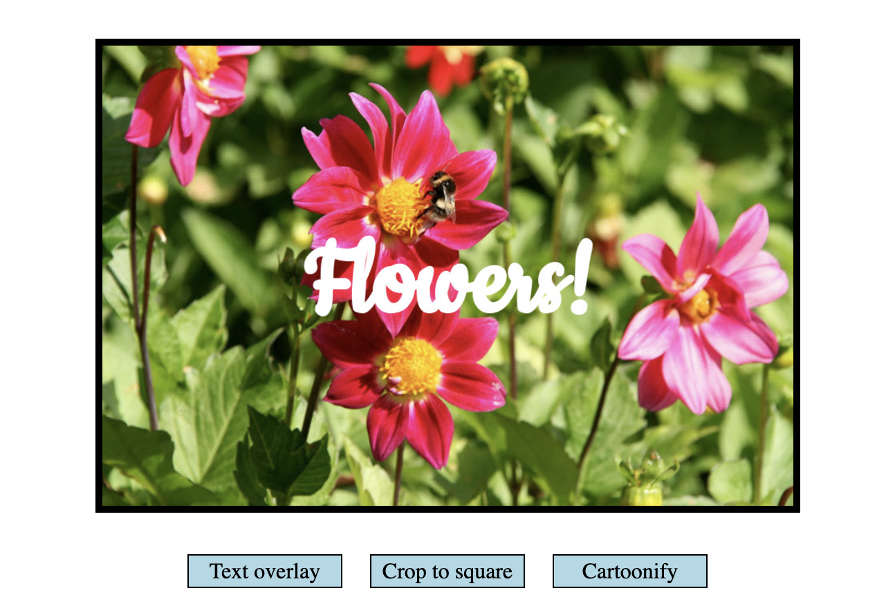

# Cloudinary Tutorial

## Introduction

In this tutorial, we're going to take a look at manipulating images using Cloudinary's Image Transformation URL API - a super-powerful interface that we can use to transform, scale, and filters to images just by changing the URL we're using to access the image.

This opens up a whole world of possibilities when it comes to delivering images into our websites and applications, with transformations happening on-the-fly, rather than having to preload everything we may want to use pre-emptively into a CMS.

So, let's dive straight in! 

## Setting Up a Development Server

First things first, we need to set up a development server that we can use to run our application. For this demo, we're going to use Vite, a super light-weight, all-in-one server/bundler that gives us to ability to package up all of the HTML/CSS/JavaScript modules we're going to use to build our app, and let us view it in a browser on our local system.

Open up your Terminal of choice, and create a directory with `mkdir`. In this example, we're going to call our project directory `image-transformation-demo`, but you can call it anything you like.

`cd` into the `image-transformation-demo` directory you've just created, and then run `npm create vite@latest`. This will show a little menu asking you some questions about how we'd like to configure Vite to use our project. Select the following options:

- Project name:
    - (Enter a project name)
- Select a framework:
    - Vanilla
- Select a variant:
    - JavaScript
- Use rolldown-vite (Experimental)?:
    - No
- Install with npm and start now?
    - No

Once you've entered all of those options, you'll now have a Vite project configured and ready to run the demo Vite server. 

To check everything is ready for us to start building our application, `cd` into the project directory Vite just created for us, and then run the following commands and open up your browser to `http://localhost:5173`.

```bash
npm install
npm run dev
```



We're ready to go!

## Installing the Cloudinary SDK

Now that we have a development server up and running, we can install the Cloudinary `url-gen` package that we'll be using to transform and modify our images as we build out our application.

Run the following command in your terminal:

```bash
npm i @cloudinary/url-gen  
```

The installation should only take a few seconds, and once it's finished, we're able to use the functions and methods of the SDK to apply transformations as we like in our app.

## Project Structure

We now have everything we need to start building and running our application, so it's time to dump the code of the Vite demo app and replace it with our own.

Delete the `./src` directory and the `./public` directory. You can run the following command to do this for you if you don't want to do it with your GUI.

```bash
rm -rf ./src ./public
```

Then, run the following command to create the files we'll be coding in for the rest of our project:

```bash
mkdir assets && touch ./assets/main.js ./assets/style.css
```

...and then replace the contents of the `index.html` file and ./assets/`style.css` with the following code respectively:

index.html:
```html
<!DOCTYPE html>
<html lang="en" >
<head>
	<link rel='stylesheet' href='/assets/style.css' />
</head>
<body>

	<div class="main">
	
		<div class="main-photo">
			
		</div>
	
		<div class="btn-group">
			<div class="btn" data-action="text">Text overlay</div>
			<div class="btn" data-action="crop">Crop to square </div>
			<div class="btn" data-action="cartoonify">Cartoonify</div>
		</div>
	
	</div>

	<script type="module" src="/assets/main.js"></script>

</body>
```

style.css:
```css
.main{height:100%;max-width:800px;width:100%;margin:auto;display:flex;align-items:center;justify-content:center;flex-direction:column}.main-photo{width:500px;height:333px;border:5px solid #000;margin:20px 0 20px 0;object-fit:contain;display:flex;align-items:center;justify-content:center;width:max-content}.main-photo img{height:100%}.btn-group{margin:0 90px}.btn{margin:10px;padding:2px 5px 2px 5px;float:left;width:100px;border:1px solid #000;background-color:lightblue;text-align:center}.btn:hover{cursor:pointer}
```

The CSS isn't that important, but let's take a close look at the HTML. You should notice that we have an `` element which points to an image hosted in the in the Cloudinary demo account that we're going to display and transform, and a bunch of buttons which we'll be able to click to apply transformations to that image.

Those buttons don't do much at the moment, but that's about to change!

## Let's Code!

### Importing the SDK

Open up the `./assets/main.js` file in your favourite IDE. This is where we'll write our code that handles our buttons being clicked and interacts with the Cloudinary API via the SDK to generate the effect we want for each one.

First, we'll import all of the modules that we're going to use from the `@cloudinary/url-gen` package we installed just a few minutes ago. Add the following to the top of the file:

```javascript
import { Cloudinary } from "@cloudinary/url-gen";
import { fill } from "@cloudinary/url-gen/actions/resize";
import { cartoonify } from "@cloudinary/url-gen/actions/effect";
import { text } from "@cloudinary/url-gen/qualifiers/source";
import { source } from "@cloudinary/url-gen/actions/overlay";
import { TextStyle } from "@cloudinary/url-gen/qualifiers/textStyle";
import { Position } from "@cloudinary/url-gen/qualifiers/position";
import { compass } from "@cloudinary/url-gen/qualifiers/gravity";
```

Some of these modules are for convenience, such as the `Position` and `compass` modules that make it easier for us to position text over our images, and others directly interact with the Cloudinary API to change our image in some way - like `fill`, `text`, and `cartoonify`.

We now have everything we need to interact with Cloudinary, so let's add a little more code to set up the elements that we want to interact with in our application. Add the following code just after the imports you just added:

```javascript
const cld = new Cloudinary({
	cloud: {
		cloudName: 'demo'
	}
});

const img = cld.image('sample.jpg');

const photoHolder = document.querySelector(".main-photo");
const imgElement = photoHolder.querySelector("img");
const btnGroup = document.querySelector(".btn-group");
const actionBtns = btnGroup.querySelectorAll("[data-action]");
```

The `cld` variable creates a Cloudinary instance that we can configure and use to interact with images stored in a Cloudinary account. In this case, we're using the `demo` cloud assets to save a little bit of time and get things rolling, but you can replace the `cloudName` property to work with your own assets if you have some already.

We then use `cld.image('sample.jpg')` to generate a reference to the image we want to work with.

The rest of the variables we've set are just references to the HTML elements we'll be manipulating with the rest of our code.

### Setting up Event Handlers

First things first, let's bind some event handlers to our buttons so we can react to them being clicked.

Add the following code to the end of your `main.js` file to create handlers for each of the buttons in our page:

```javascript
actionBtns.forEach(btn => {

	btn.addEventListener("click", function(e){

		e.preventDefault();
		e.stopImmediatePropagation();

		const action = this.dataset.action;

		console.log(action);
        
        // applyTransformation(action);

	}, false);

});
```

If you haven't done so already, run `npm run dev` in your Terminal to spin up the development server, and go to `http://localhost:5173`. You should see the following, and if you open up the Developer Tools and click any of the buttons, you should see the action each one is going to undertake logging to the console.



It's a good start, but it's not very exciting. Fear not, it's about to get really cool.

### Using the Cloudinary SDK
#### Cropping an Image

You might have noticed in the last chunk of code that we have a commented out function call which passes through the action of the button clicked: `applyTransformation(action);`. This will be a catch-all method which will apply the desired transformation to our image depending on the button that's clicked. 

After the `.forEach` loop that we used to bind event handlers to our button, define the `applyTransformation` function:

```javascript
function applyTransformation(transformationType){

    if(transformationType === "crop"){

        // Crop our image to a square

    }

    if(transformationType === "cartoonify"){
        // Cartoonify the image
    }

    if(transformationType === "text"){

        // Add a text overlay to our image

	}

}
```

Whenever one of the buttons in our web page is clicked, the `applyTransformation` function will be called, and if the `transformationType` is known, that transformation will be applied to our image. But first, we'll need to use the Cloudinary SDK to apply that transformation to our images.

Let's start with cropping.

## Cropping an image

When we started working on this JavaScript file, we imported all of the methods we wanted to use to make image transformations from the Cloudinary SDK. We also created a variable (`img`) to would reference an image in the demo Cloudinary account that we could apply transformations to. Now it's time to put them to work.

Cropping an image is really simple. In the code block for the`if(transformationType === "crop")` `if` statement, add the following code:

```javascript
img.resize(fill().width(250).height(250));
imgElement.src = img.toURL();
```

The first line uses the SDK to resize our image to a width and height of 250px using the `fill()` method ([fill() docs](https://cloudinary.com/documentation/transformation_reference#c_fill)). This method takes our image and transforms it to the specified dimensions without distorting the image. It does this by first scaling the image to the required dimensions, and then cropping it if the aspect ratio of the cropped image is different from our original images aspect ratio.

Under the hood, the Cloudinary SDK is generating a transformation URL which we can use to to get the newly transformed image directly from Cloudinary. Once the URL is generated, we can use the `toURL()` method on the `img` object to get a fully-qualified URL that we can use to set as the source for any image element on our page - which is exactly what we do with `imgElement.src = img.toURL()`.

Now, if we uncomment the `// applyTransformation(action);` line in our event handler, reload our page and click the "Crop to Square" button, you should see something like the following in your browser:



Nice and easy!

## Adding an Effect

We can also apply whole host of [effects](https://cloudinary.com/documentation/transformation_reference#e_effect) to an image using the SDK - and it's another one-liner that we can add in a matter of seconds!

In the code block for the`if(transformationType === "cartoonify")` `if` statement, add the following code:

```javascript
img.effect(cartoonify());
imgElement.src = img.toURL();
```

Then reload the page and click "Cartoonify". If all's gone well, you should see the following:



Because we use the same `img` object when applying our transformations, we can both crop our image _and_ apply an effect:



## Adding a Text Overlay

And leads us nicely to our final transformation - a text overlay. This functionality is super-useful for watermarking, highlighting, or describing images dynamically, but it it's the most involved function call of our demo. With that in mind, add the following block of code to the code block for the `if(transformationType === "text")` `if` statement, and then we'll break it down into its component parts.

```javascript
img.overlay(
    source(
        text(
            'Flowers!',
            new TextStyle('Cookie', 150)
            .fontWeight('bold'))
            .textColor('#FFF')
    ).position(
        new Position().gravity(compass('center'))
    )
)

imgElement.src = img.toURL();
```

Just as before, we reference the `img` object we defined at the start of this tutorial, and then we call the overlay function ([docs](https://cloudinary.com/documentation/transformation_reference#e_overlay)).

The overlay function is one which can blend multiple assets together to create a new, combined image - and this case, we're generating and then adding a text layer ([docs](https://cloudinary.com/documentation/transformation_reference#l_text)).

With the `text()` method, we're able to pass in a string of text that we want to render, along with a bunch of parameters that tells Cloudinary how to style that text. In this case, we're using a bolded "Cookie" font style, and we're going to make it white.

Next, we need to tell Cloudinary where we want the text to be positioned in the image. This is where we can use the `Position`, `gravity`, and `compass` modules we imported at the start of our script. By passing through a new `Position` object with the "gravity" set to the center of the image using the `compass` module, the SDK is able to generate a Transformation URL that will center the text in the middle of our image - regardless of the dimensions of the text or the image!

If you reload the page and click the "Text Overlay" button, you should see the following:



## That's all, folks!

We've only just popped the hood on the whole array of image transformations that can be achieved with the Cloudinary SDK. From outpainting images with Generative AI, to dynamically centering faces in videos, to classifying objects on-the-fly - the possibilities are endless.

You can find full reference documentation for the Image Transformation API [here](https://cloudinary.com/documentation/transformation_reference), as well as documentation for [dozens of SDKs](https://cloudinary.com/documentation/) for your favourite programming language. Happy transforming!